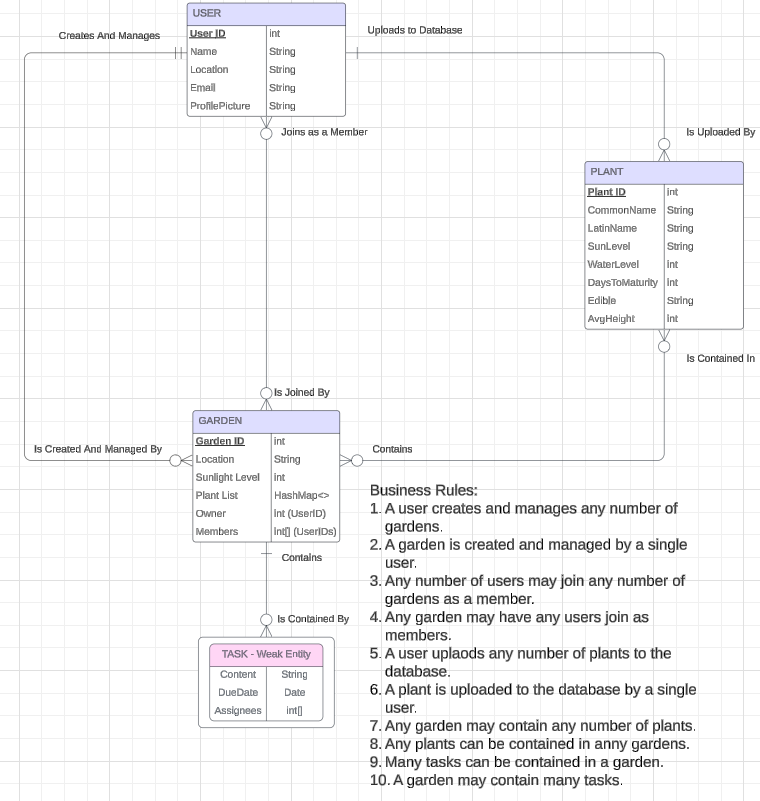
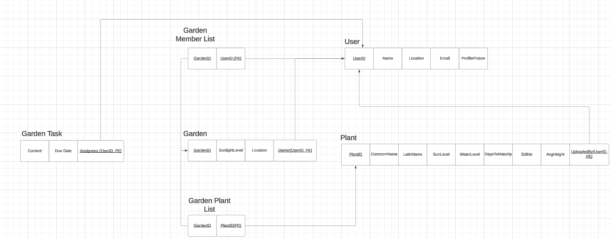
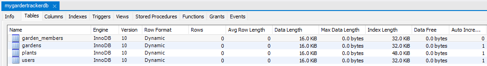
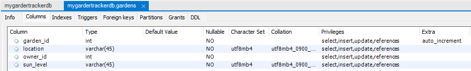
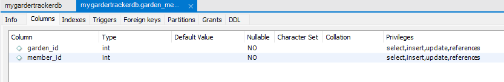
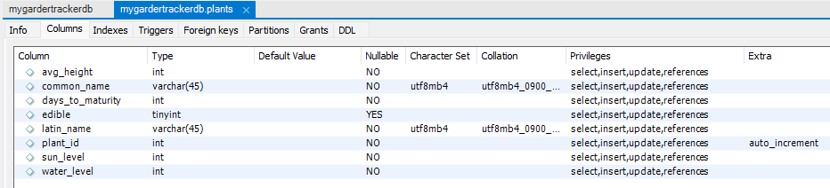
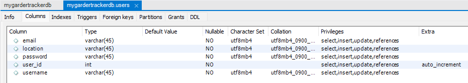

# Welcome to the Garden Tracker!
This project is a Vue and SQL based client and server website.
Users are able to add their location, at which point they will be shown a real time, updated weather forecast for their location.
Users may create gardens, which are entities whose location and weather history are tracked as well.
Users may upload plants to the database, and then arrange gardens consisting of collections of plants.

## Backend
> The backend framework consists of models and routes, following a traditional REST API communication structure. In the models, we have files that serve as ways to encapsulate all of the methods that represent manipulations to various data models stored in our database. In the routes,when the backend server receives a request, it decodes the information and calls the appropriate route file method, which is a wrapper for the data model method. Thus, a user can request to modify the state of one or many pieces of data stored in our database.

## Frontend
> The frontend framework consists of a classic Vue, TypeScript, and Vite stack. Users, once signed in and verified, can engage with various elements of the site to trigger responses from the backend.

## Weather
> How is data for front end weather display loaded and parsed? Once the user logs in, the location data that is recorded by the user and stored in the user entity data is automatically retrieved by the backend. This location data is formatted into an external API call, which accesses the OpenWeather One Call API. Once the relevant data has been received from OpenWeather, the backend will parse and filter the data to be easily displayed in the front end component. However, we do not want users to continuously refresh the home page, sending many external API calls (which is costly).

## Entity Relationship Diagram
Detailing the parameters and type requirements of the entities of the site.

## Relationship Diagram
Here we see how the various entities that comprise the site relate to each other. The user and the garden entity tend to receive and generate the most action, while the plants are used mainly as a reference.

## MySQL Database Tables
Overall view of the database tables

Gardens table

Garden members table

Plants table

Users table

