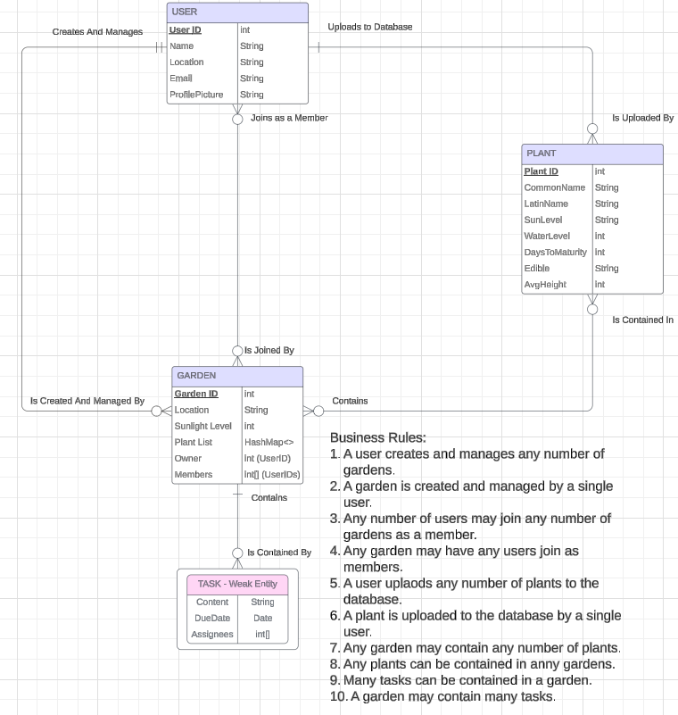
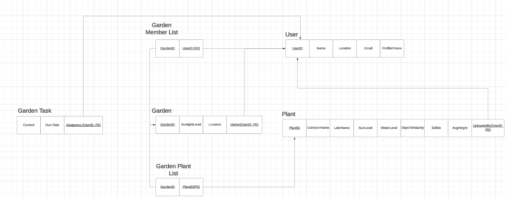
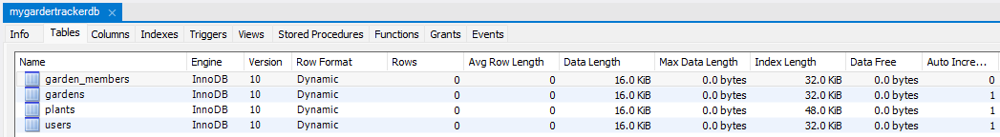
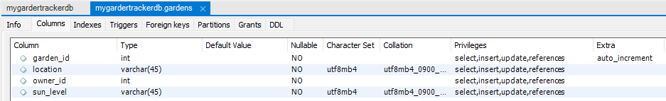
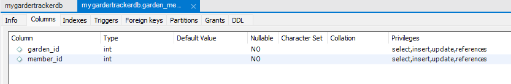
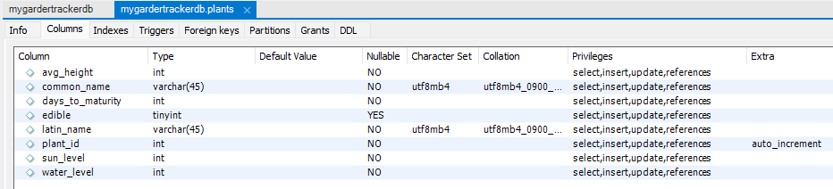
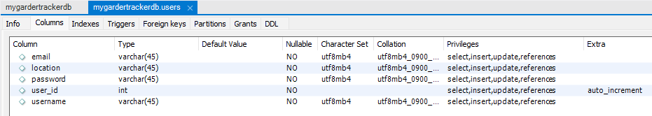

# Welcome to the Garden Tracker!
This project is a SQL based client and server website.
Users are able to add their location, at which point they will be shown a real time, updated weather forecast for their location.
Users may create gardens, which are entities whose location and weather history are tracked as well.
Users may upload plants to the database, and then arrange gardens consisting of collections of plants.

## Entity Relationship Diagram
Detailing the parameters and type requirements of the entities of the site.

## Relationship Diagram
Here we see how the various entities that comprise the site relate to each other. The user and the garden entity tend to receive and generate the most action, while the plants are used mainly as a reference.

## MySQL Database Tables
Overall view of the database tables

Gardens table

Garden members table

Plants table

Users table
